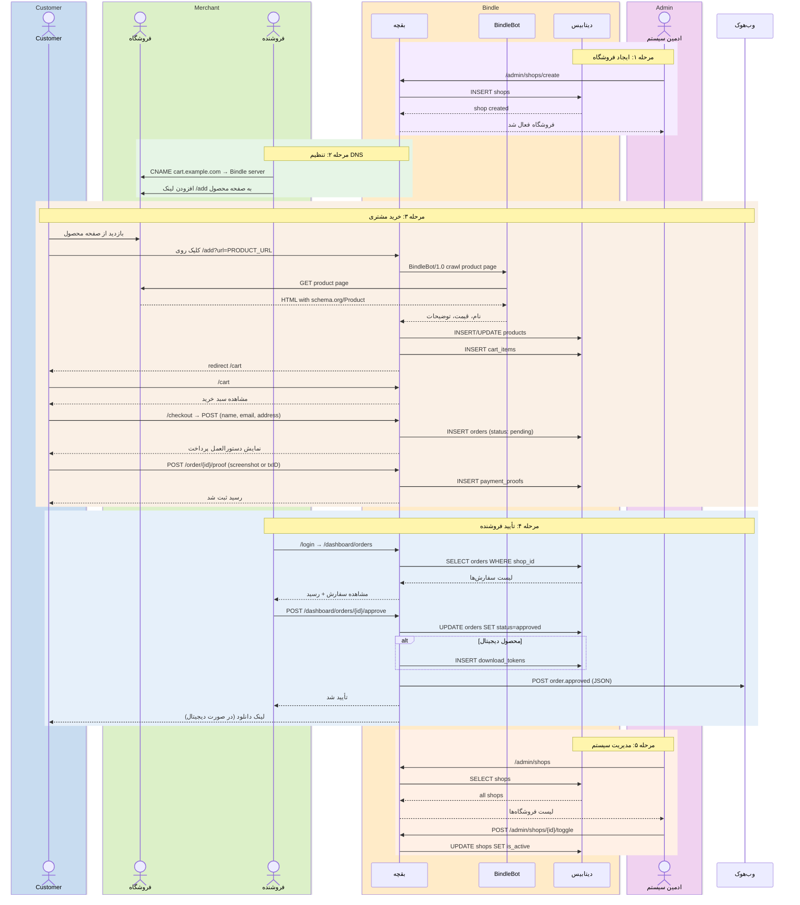

# بقچه (Bindle)

مدیریت سبد خرید و پرداخت دستی برای فروشگاه‌های آنلاین.

```mermaid
sequenceDiagram
    box rgb(200, 220, 240) Customer
        actor Customer
    end
    box rgb(220, 240, 200) Merchant
        actor MerchantSite as فروشگاه
        actor Merchant as فروشنده
    end
    box rgb(255, 235, 200) Bindle
        participant Bindle as بقچه
        participant Crawler as BindleBot
        participant DB as دیتابیس
    end
    box rgb(240, 210, 240) Admin
        actor Admin as ادمین سیستم
    end
    participant Webhook as وب‌هوک

    rect rgb(245, 235, 255)
        Note over Admin,DB: مرحله ۱: ایجاد فروشگاه
        Admin->>Bindle: /admin/shops/create
        Bindle->>DB: INSERT shops
        DB-->>Bindle: shop created
        Bindle-->>Admin: فروشگاه فعال شد
    end

    rect rgb(230, 245, 230)
        Note over Merchant,Bindle: مرحله ۲: تنظیم DNS
        Merchant->>MerchantSite: CNAME cart.example.com → Bindle server
        Merchant->>MerchantSite: افزودن لینک /add به صفحه محصول
    end

    rect rgb(250, 240, 230)
        Note over Customer,Webhook: مرحله ۳: خرید مشتری
        Customer->>MerchantSite: بازدید از صفحه محصول
        Customer->>Bindle: کلیک روی /add?url=PRODUCT_URL
        Bindle->>Crawler: BindleBot/1.0 crawl product page
        Crawler->>MerchantSite: GET product page
        MerchantSite-->>Crawler: HTML with schema.org/Product
        Crawler-->>Bindle: نام، قیمت، توضیحات
        Bindle->>DB: INSERT/UPDATE products
        Bindle->>DB: INSERT cart_items
        Bindle-->>Customer: redirect /cart
        Customer->>Bindle: /cart
        Bindle-->>Customer: مشاهده سبد خرید
        Customer->>Bindle: /checkout → POST (name, email, address)
        Bindle->>DB: INSERT orders (status: pending)
        Bindle-->>Customer: نمایش دستورالعمل پرداخت
        Customer->>Bindle: POST /order/{id}/proof (screenshot or txID)
        Bindle->>DB: INSERT payment_proofs
        Bindle-->>Customer: رسید ثبت شد
    end

    rect rgb(230, 240, 250)
        Note over Merchant,Webhook: مرحله ۴: تأیید فروشنده
        Merchant->>Bindle: /login → /dashboard/orders
        Bindle->>DB: SELECT orders WHERE shop_id
        DB-->>Bindle: لیست سفارش‌ها
        Bindle-->>Merchant: مشاهده سفارش + رسید
        Merchant->>Bindle: POST /dashboard/orders/{id}/approve
        Bindle->>DB: UPDATE orders SET status=approved
        alt محصول دیجیتال
            Bindle->>DB: INSERT download_tokens
        end
        Bindle->>Webhook: POST order.approved (JSON)
        Bindle-->>Merchant: تأیید شد
        Bindle-->>Customer: لینک دانلود (در صورت دیجیتال)
    end

    rect rgb(255, 240, 230)
        Note over Admin,DB: مرحله ۵: مدیریت سیستم
        Admin->>Bindle: /admin/shops
        Bindle->>DB: SELECT shops
        DB-->>Bindle: all shops
        Bindle-->>Admin: لیست فروشگاه‌ها
        Admin->>Bindle: POST /admin/shops/{id}/toggle
        Bindle->>DB: UPDATE shops SET is_active
    end
```
